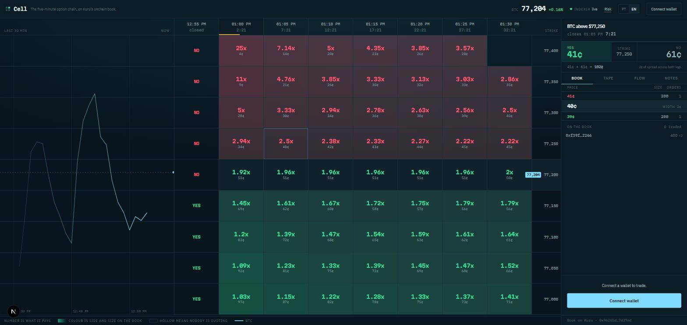

# Cell

**A prediction grid on Monad. Every cell is a five-minute YES/NO market with a real order book.**

A live BTC chart is a board of cells. Each cell asks one question — *will BTC be
above $76,750 at 10:50?* — and each cell is a pair of ERC-20s listed as spot
markets on [Kuru](https://kuru.io)'s onchain CLOB. Click a cell and you get the
live book, the tape, and who is standing on it. Place and cancel through Kuru.
Settlement is a Chainlink CRE workflow writing onchain.

No mock books. No static JSON. If Kuru is down, Cell is down.



*Left: the board. The big number in a cell is what it pays; the line under it is the
implied probability, the market width, and how many makers stand behind it. Right:
one cell open — the live L2 book from the indexer, the spread, and the address
quoting it.*

MIT licensed, public from commit 1.

---

## Who this is for

**Orderflow traders who already think in five-minute windows.** The people using
Grid Arena and Outrive today, who read a tape and want to know what is resting at
0.53 before they lift it.

Not "crypto traders in general." The distinction decides the whole product:

|                          | A casino tile                    | Cell                                            |
| ------------------------ | -------------------------------- | ----------------------------------------------- |
| What you see             | a multiplier                     | a multiplier, **and the book behind it**         |
| Who you trade against    | the house                        | whoever is quoting — their address is on screen  |
| Where the price comes from| a formula                        | the best bid and offer on a public CLOB          |
| Whether you can make     | no                               | yes: post, get filled, get paid the spread       |

The headline number on a tile is `1.9x`, because that is how a trader decides.
The line underneath it — `53% · 2.0w · 1` — is the implied probability, the market
width in probability points, and how many makers are behind it. That last number
is the one a casino cannot show you.

---

## How it works

```
                    ┌──────────────────────────────────────────┐
   roll-windows ───►│ CellFactory                              │
   (cron, 1 min)    │  createWindow(BTC-USD, endTs, strike)    │
                    │    ├─ mints cYES / cNO (ERC-20, 6 dec)   │
                    │    └─ Router.deployProxy ×2 ──────────┐  │
                    └──────────────────────────────────────┼──┘
                                                           ▼
                                              ┌───────────────────────┐
   seed ─────────── mintSet + batchUpdate ───►│ Kuru CLOB             │
   (cron, 1 min)                              │  cYES/USDC  cNO/USDC  │
   you ──────────── GTC.placeLimit ──────────►│                       │
                                              └───────────┬───────────┘
                                                          │ OrderCreated
                                                          │ Trade
                                                          │ OrdersCanceled
                                                          ▼
                                              ┌───────────────────────┐
                                              │ Envio HyperIndex      │
                                              │  BookLevel  CellState │
                                              │  WindowCvd  Fill      │
                                              └───────────┬───────────┘
                                                          │ GraphQL
                                                          ▼
                                                    the grid you see

   Chainlink CRE ── price API + onchain clock ──► CellSettlementReceiver
   (cron, 30s)                                     └─► CellFactory.settle
```

**The economics fit in four lines.** `mintSet(id, n)` locks `n` USDC and returns
`n` cYES **and** `n` cNO. Each leg trades against USDC on its own Kuru book. After
settlement the winning leg redeems 1:1 and the loser is worth zero. So the YES
best ask is an upper bound on the market's probability, `1 −` the NO best bid is
another, and the factory holds exactly what it owes. There is no privileged mint:
seeding the book uses the same call you would.

If the settler goes quiet for an hour past a window's close, **anyone** can call
`voidWindow` and both legs redeem at 0.50. A silent oracle cannot trap collateral.

---

## What each piece actually does

Every dependency here drives a live feature. None of them is a logo.

### Kuru — New Assets *and* the consumer app

`CellFactory.createWindow` deploys two ERC-20s and calls `Router.deployProxy`
twice, listing cYES/USDC and cNO/USDC with identical parameters (`pricePrecision`
1e6, `tickSize` 1000 — a tick is 10 bps of probability). **The grid is the
trading UI**: every order in this app goes through `@kuru-labs/kuru-sdk`'s own
`GTC.placeLimit` and `OrderCanceler.cancelOrders` against those markets.

Issuance, redemption and who seeds the first quote: [`docs/LIQUIDITY.md`](docs/LIQUIDITY.md).

### Envio HyperIndex — the book *is* the index

`contractRegister` on `WindowCreated` starts following both Kuru markets the
instant they are announced, so a cell opened while the indexer is running is
indexed from its first order. Handlers fold `OrderCreated`, `Trade` and
`OrdersCanceled` into `BookLevel` (depth per price), `MarketMaker` (an exact
distinct maker count), `CellState` (one denormalised row per cell, so a 7×8 board
is one query) and `WindowCvd` (signed taker flow in 15-second buckets).

The fold logic lives in `packages/indexer/src/folds.ts` as plain functions and is
covered by tests that replay a real event sequence. See
[`packages/indexer/README.md`](packages/indexer/README.md).

### Chainlink CRE — orchestration, not a comment

A five-minute binary needs two facts from different places: **when** the window
closed (onchain) and **what the price was** (not). CRE is the only thing that can
hold both inside one attested execution. Every 30 seconds the workflow reads
`CellFactory.pendingSettlement`, fetches the reference price once per DON node,
takes the median, and writes **one** report covering every window that closed —
seven strikes close at the same instant, so a column costs one report, not seven.

`CellSettlementReceiver` is the onchain half: ERC-165 `IReceiver`, gated on the
Forwarder, settling each window in a `try/catch` so one already-resolved window
cannot sink the batch. See [`packages/cre/README.md`](packages/cre/README.md).

### Mera — one passkey, many keys, and *not* the wallet

The PRF output derived here never becomes a signing key and never touches a
transaction. Trading is signed by an ordinary Monad wallet.

What the passkey does is encrypt your private notes on a cell. A **salt
namespace** — `SHA-256("cell.prf.v1|<rpId>|notes")` — is evaluated by WebAuthn's
PRF extension and run through HKDF into one AES-256-GCM key. The cell's key is
bound in as AAD, so a note cannot be moved between cells. The server stores
ciphertext and will only hand it back to a caller that can present a tag derived
from the same PRF output.

Tap the same passkey on a second device and the same notes open, because the same
credential over the same salt returns the same 32 bytes. See
[`docs/PASSKEY.md`](docs/PASSKEY.md) for the cross-device test.

---

## Run it

You need Node 20+. Everything below works on macOS, Linux and Windows.

```bash
git clone <this repo> && cd cell
npm install
cp .env.example .env
```

### Against a local chain, in four terminals

```bash
# 1  a chain
npm --prefix packages/contracts run node

# 2  deploy, open the board, quote both sides of every cell
npm run contracts:build
npm --prefix packages/contracts run deploy:local
npm --prefix packages/contracts run windows:roll:local
npm --prefix packages/contracts run seed:local

# 3  index it
npm --prefix packages/contracts run indexer:local

# 4  the app
cp apps/web/.env.local.example apps/web/.env.local   # paste the addresses from step 2
npm run dev
```

Then take some liquidity, so there is a tape:

```bash
FILLS=4 npm --prefix packages/contracts run demo:fills:local
```

Terminal 3 is a **development stand-in** for `envio dev`, for machines without
Docker. It reads real logs with `eth_getLogs` and runs the *same* fold functions
that ship to Envio. Production is Envio; see the indexer README for `envio
codegen && envio dev`, which needs Linux, macOS or WSL2.

### Against Monad testnet

```bash
# fund DEPLOYER_PRIVATE_KEY at https://faucet.monad.xyz, then
npm run deploy:testnet        # CellFactory + CellSettlementReceiver + faucet USDC
npm run windows:roll          # open the next 8 columns × 7 strikes
npm run seed                  # quote both legs of every live cell

npm --prefix packages/indexer run sync && npm --prefix packages/indexer run codegen
npm --prefix packages/cre run sync && npm --prefix packages/cre run simulate
```

Put the roller and the seeder on a one-minute cron and the board stays full.

---

## Liquidity: we seed both sides of every window

A five-minute binary with no resting orders is not a market, it is a screenshot.
So the maker is part of the system, not an afterthought — and it is a script in
this repo you can read: `packages/contracts/scripts/seed.ts`.

Each pass, for every live cell:

1. **Price it.** A driftless lognormal over the time remaining, using realised
   vol from the last hour of one-minute closes. Not a pricing engine — a
   reference the book is free to disagree with, and the UI shows both.
2. **Get inventory.** `mintSet` locks collateral and returns one cYES and one cNO
   per unit. The same call any trader makes.
3. **Quote.** One `batchUpdate` per market cancels the previous quote and posts a
   fresh bid and ask, 200 contracts a side, 2 points wide (0.01 either side of
   fair), post-only.

Two rules keep it honest rather than decorative:

- **Nothing is quoted outside `[0.02, 0.98]`.** A market at 0.997 is not
  liquidity, it is an invitation to be picked off.
- **Quoting stops 20 seconds before the bell.** Nobody wants to be filled at the
  buzzer on a stale quote.

Inventory is recyclable: `burnSet` returns collateral for equal YES and NO before
settlement, so capital rolls from window to window instead of being locked per
cell. Sizing, risk per cell and how the numbers were picked are in
[`docs/LIQUIDITY.md`](docs/LIQUIDITY.md).

---

## Next 30 days

Targets, not themes. Each week has a number that is either hit or not.

| Week | What ships                                                                                                                                                                                             | The number                                                                 |
| ---- | ------------------------------------------------------------------------------------------------------------------------------------------------------------------------------------------------------ | -------------------------------------------------------------------------- |
| 1    | Monad testnet deploy with the roller and seeder on cron, Envio Cloud indexer, CRE workflow deployed and the Forwarder wired so `settle` leaves the deploy key.                                          | **56 cells quoted two-sided, 24h a day, for 7 straight days.** Uptime is the product. |
| 2    | Maker economics: quote off the book's own imbalance instead of a flat model, inventory skew across the two legs, and a public P&L page for the seeding account.                                          | **Seeding account P&L ≥ −2% of quoted notional over 1,000 fills.** If the maker cannot survive adverse selection, nothing above it matters. |
| 3    | Taker depth: market orders via `placeAndExecuteMarketBuy` with slippage bounds, position and P&L per window from the indexer's `Account` rows, one-click redeem across every settled cell.               | **25 distinct taker addresses that are not ours, and 250 fills.** Recruited by hand from Grid Arena and Outrive users. |
| 4    | Second underlying (ETH), the workflow-id pin in `CellSettlementReceiver`, and a mainnet deploy against real USDC with the maker's own capital and published limits.                                     | **$25k of resting depth across the board and $100k of settled notional in the first week.** |

**Liquidity beyond us.** We seed both sides from day one, but a market with one
maker is a market with one point of failure. The plan is not "hope makers come":
it is a maker program with three named asks — a rebate funded from taker fees
once fees exist, a documented quoting bot (the seeder, published as a template
anyone can run), and direct outreach to the two or three desks already market
making on Kuru spot. Week 2's P&L page exists to make that pitch checkable
rather than rhetorical.

Deliberately not on this list: mobile, a token, a Discord bot, an ETH/BTC
heatmap. One underlying, one book, one settlement path, made good.

Where this is being submitted, and which bounties it does and does not fit:
[`docs/SUBMISSION.md`](docs/SUBMISSION.md).

---

## Repo map

| Path                 | What is in it                                                                    |
| -------------------- | -------------------------------------------------------------------------------- |
| `packages/contracts` | `CellFactory`, `OutcomeToken`, `CellSettlementReceiver`, and the deploy/roll/seed/fill scripts |
| `packages/core`      | the one definition of a cell: window math, the strike ladder, Kuru tick conversions |
| `packages/indexer`   | Envio HyperIndex — `config.yaml`, `schema.graphql`, handlers, folds, tests        |
| `packages/cre`       | the Chainlink CRE settlement workflow                                            |
| `apps/web`           | the grid, the cell panel, the ticket, the passkey notes                          |
| `docs`               | architecture, liquidity, CRE and passkey notes                                   |

```bash
npm run contracts:test     # 22 tests: issuance, settlement, void, an end-to-end fill
npm --prefix packages/indexer run check   # config vs. ABIs, then 8 fold tests
npm --prefix packages/cre run check       # ABI drift, config addresses, price parsing
npm run build              # the app
```

---

## Risk

Every contract pays 1 unit of collateral if its leg wins and 0 if it loses. You
can lose everything you put in. Settlement uses a public reference price at the
close of the window. On testnet the tokens are worth nothing. The app says all of
this before it will send your first order.
